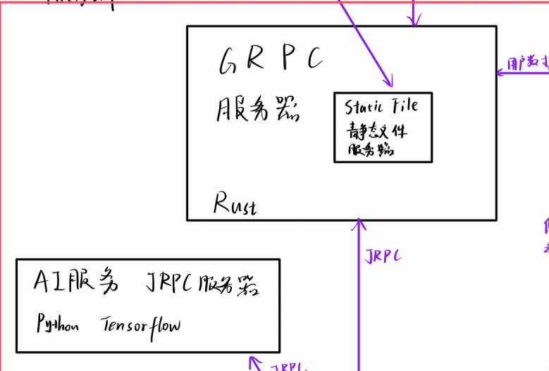
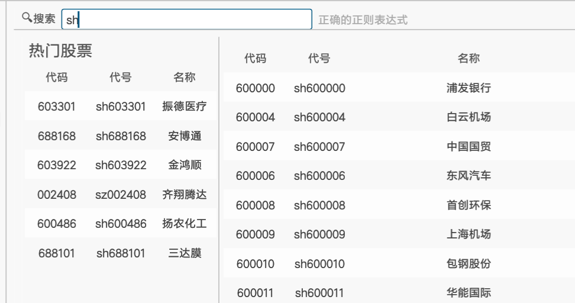
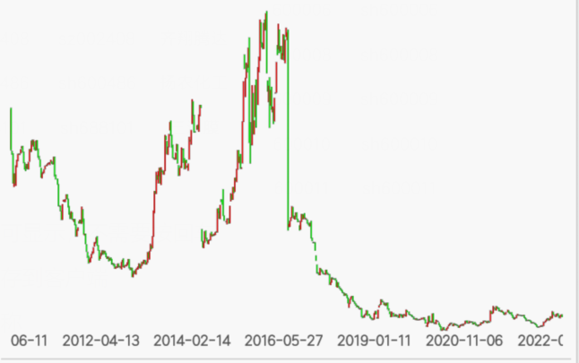
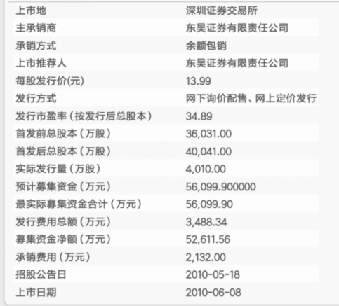

# Financial Analysis

[toc]

## 项目结构

### 拓扑结构


## 运行说明

项目构建为 Docker 容器，运行其需要 Docker/Podman 软件。

由于爬虫部分使用了浏览器操作以减少被防爬拦截，所以难以塞进 Docker 中，仅提供源码和在线运行环境。

###  仅运行客户端

注意需要在菜单栏切换服务器到 `a.chiro.work`。

1. 网页版

   release 包的 `dist/` 下即为静态文件，`windows` / `linux` 下的 `dist` 的静态文件都是相同的。

   将这些静态文件挂载到静态文件服务器即可浏览网页客户端。

2. PC 客户端

   直接运行 `financial_analysis.exe`。

3. Android 客户端

   安装即用，用法和网页一致。

### 运行服务端

#### 运行 Docker 中的服务程序

由于部分内容难以塞进 Docker 里，在 Docker 里的只有这些：




使用给定的镜像文件导入 Docker：

```shell
docker load -i financial.tar.gz
```

或者直接从 DockerHub 上拉取：

```shell
docker pull chiro2001/financial-analysis:v2
```

然后从这个镜像文件运行一个容器：

```shell
docker run -it --rm -p 51411:51411 chiro2001/financial-analysis:v2
```

访问 http://localhost:51411 即可访问静态网页客户端内容。

#### 运行 Release 包中的程序

内含：GRPC 服务器、静态文件服务器、客户端静态文件。

双击 `run_server.cmd`，然后打开 http://localhost:51411 即可访问客户端。

## 客户端使用说明

**主要功能**

1. 用户系统

   1. 在打开客户端后如果不登录，不获取用户对应 `token` 是无法与后端验证通信的
   2. 由于懒所以用户数据没有在数据库上做持久化，服务器重启后除了 `test` 其他用户数据会丢失
   3. 默认用户、密码为 `test`，打开客户端之后默认就是这个
   4. 注册是正常工作的
   5. 又因为懒得做 JWT 所以现在所有用户的 `token` 都是字符串 `"token"`，不过不影响使用就是了

2. 股票搜索

   

   1. 在搜索框中键入搜索词即可显示，不需要按回车
   2. 所有的股票简略信息被缓存到客户端
   3. 可以是股票代码、股票名称
   4. 支持正则表达式检索
   5. FIXME: 
      1. 这里有点问题，检索出的值好像是上一次搜索词的值，
      2. 可以在输入之后按一下空格以更新结果

3. 热门股票

   1. 侧边栏是随机选出的 6 支股票
   2. 对这些股票的操作和搜索结果一致

4. 查看股票 K 线

   

   1. **双击**（手机上也是双击）搜索结果，打开详细信息窗口
   2. 可以切换 月/周/日 线
   3. 鼠标悬停可以看当前坐标的数据信息
   4. 底部是对应日期信息
   5. 拉动窗口可以缩放图像

5. 预测股票 K 线

   1. 鼠标拉动或者点击填写预测数量，然后点击预测
   2. 预测准确率好像不咋样
   3. 需要时间比较长，约 40s-1min
   4. 可能会预测出无效的信息

6. 股票发行信息

   

   1. K 线下左侧栏目

7. 股票财务数据

   1. K 线下右侧栏目
   2. 鼠标拉动或者点击选择数据年份
   3. 然后点击按钮获取数据

8. 三年营业收入数据分析

   1. K 线下中间栏目
   2. 打开股票详细信息窗口后自动加载并计算
   3. 计算过程中获取的数据、计算结果会存入数据库 `dipiper.financial_analysis` 和 `dipiper.financial_data`

9. 其他功能

   1. 切换服务器
      1. 在菜单栏可以切换服务器
      2. `a.chiro.work` 一般都开启
      3. `localhost` 指的是本机地址，如果服务端运行在本机就选择这个
      4. 演示的时候请切换到 `a.chiro.work`
   2. 调试模式
      1. 菜单栏点击调试模式可以打开调试侧边栏
      2. 可以看 CPU 使用、帧率之类的
   3. 退出登录
      1. 点击后可以退出登录再重新登录
      2. 清除本地 `token` 信息
   4. 重新连接后端
      1. 调试用
   5. 主题切换器
      1. 左上角
      2. 点击可以切换白色 / 黑色主题

## 项目亮点

1. 功能丰富
   1. 提供多种功能 +上面列出的
2. 界面美观
3. 多端互联
   1. 使用 Rust 构建了大部分业务逻辑
   2. 同时使用 Rust 构建了客户端前端
4. 使用
   1. 使用编译型语言 Rust，运行速度快
   2. 客户端、服务端体积较小
   3. 

